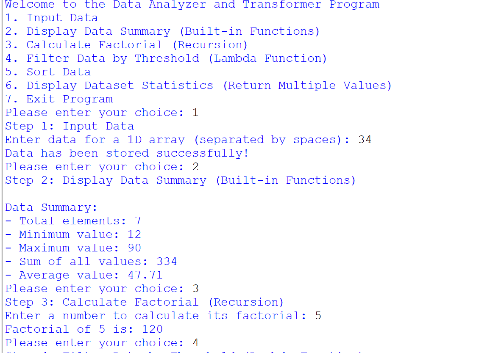
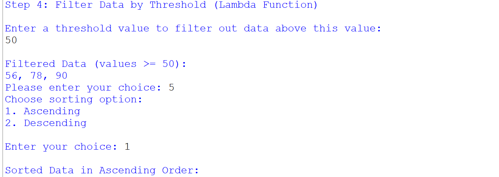

# 🎯 Data Analyzer & Transformer Program
### *A Python-powered interactive data toolkit*

---

> 📊 **Analyze · Transform · Explore** — Your all-in-one data companion built with Python fundamentals!

---

## ✨ Features at a Glance

| #  | Feature | Technique Used |
|----|---------|---------------|
| 1️⃣ | **Input Data** | List & Map Functions |
| 2️⃣ | **Data Summary** | Built-in Functions (`len`, `min`, `max`, `sum`) |
| 3️⃣ | **Factorial Calculator** | 🔁 Recursion |
| 4️⃣ | **Filter by Threshold** | ⚡ Lambda Functions |
| 5️⃣ | **Sort Data** | Ascending & Descending |
| 6️⃣ | **Dataset Statistics** | Multiple Return Values |
| 7️⃣ | **Exit** | Clean Program Termination |

---

## 🖥️ Program in Action

### 📌 Step 1–3 · Input, Summary & Factorial


> User selects options 1 → 2 → 3, inputs data, views the summary stats, and calculates `5! = 120`

---

### 📌 Step 4–5 · Filter & Sort


> Threshold set to `50` → Filtered result: `56, 78, 90`
> Then sorted in **Ascending Order**

---

### 📌 Step 5–7 · Full Statistics & Exit


> Final dataset statistics displayed, then program exits gracefully 👋

---

## 🧠 Concepts Demonstrated

```python
# 🔁 Recursion — Factorial
def factorial(n):
    if n == 0 or n == 1:
        return 1
    return n * factorial(n - 1)

# ⚡ Lambda — Filter data above threshold
filtered = list(filter(lambda x: x >= threshold, data))

# 📦 Multiple Return Values
def dataset_statistics(numbers):
    return min(numbers), max(numbers), sum(numbers), sum(numbers)/len(numbers)
```

---

## 🚀 How to Run

```bash
# Clone or download the file
python pro_4.py
```

**Then follow the on-screen menu — just enter a number (1–7)!**

---

## 📁 Project Structure

```
📦 data-analyzer/
 ┣ 📜 pro_4.py          # Main program
 ┗ 📖 README.md         # You are here!
```

---

## 🧪 Sample Output

```
Welcome to the Data Analyzer and Transformer Program
-----------------------------------------------------
Data Summary:
  - Total elements : 7
  - Minimum value  : 12
  - Maximum value  : 90
  - Sum            : 334
  - Average        : 47.71

Factorial of 5 is: 120

Filtered Data (values >= 50): 56, 78, 90

Sorted Data in Ascending Order: 12, 21, 34, 43, 56, 78, 90
```

---

## 🛠️ Built With


---

## 📚 Learning Outcomes

- ✅ Using **built-in functions** for quick data analysis
- ✅ Writing **recursive functions** for mathematical computations
- ✅ Applying **lambda functions** for concise filtering logic
- ✅ Returning **multiple values** from a single function
- ✅ Building an **interactive menu-driven** CLI application

---
pransu patel
